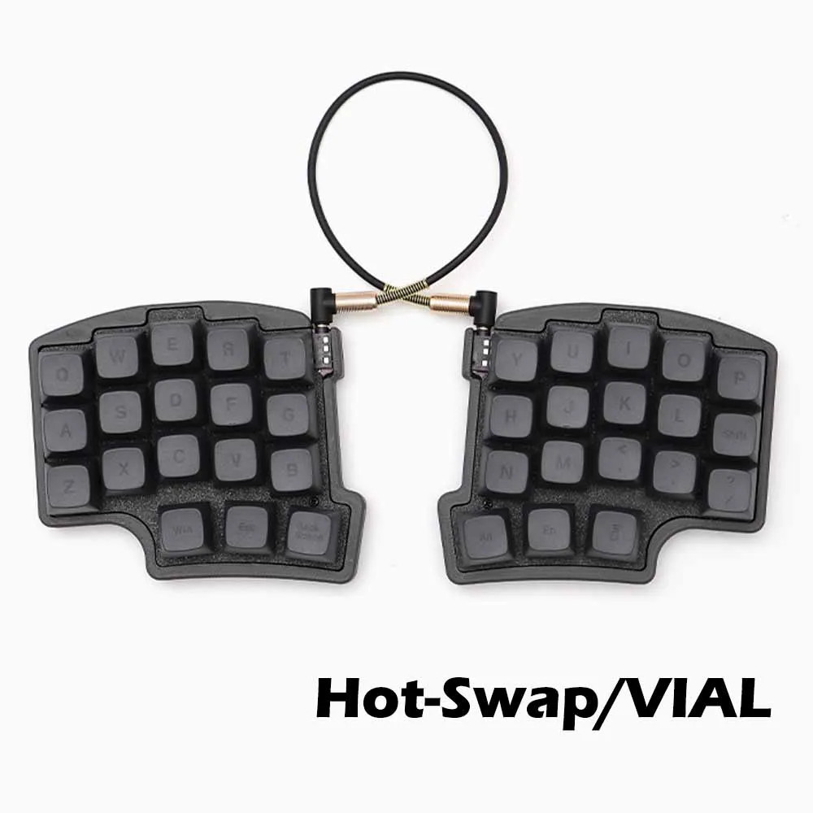
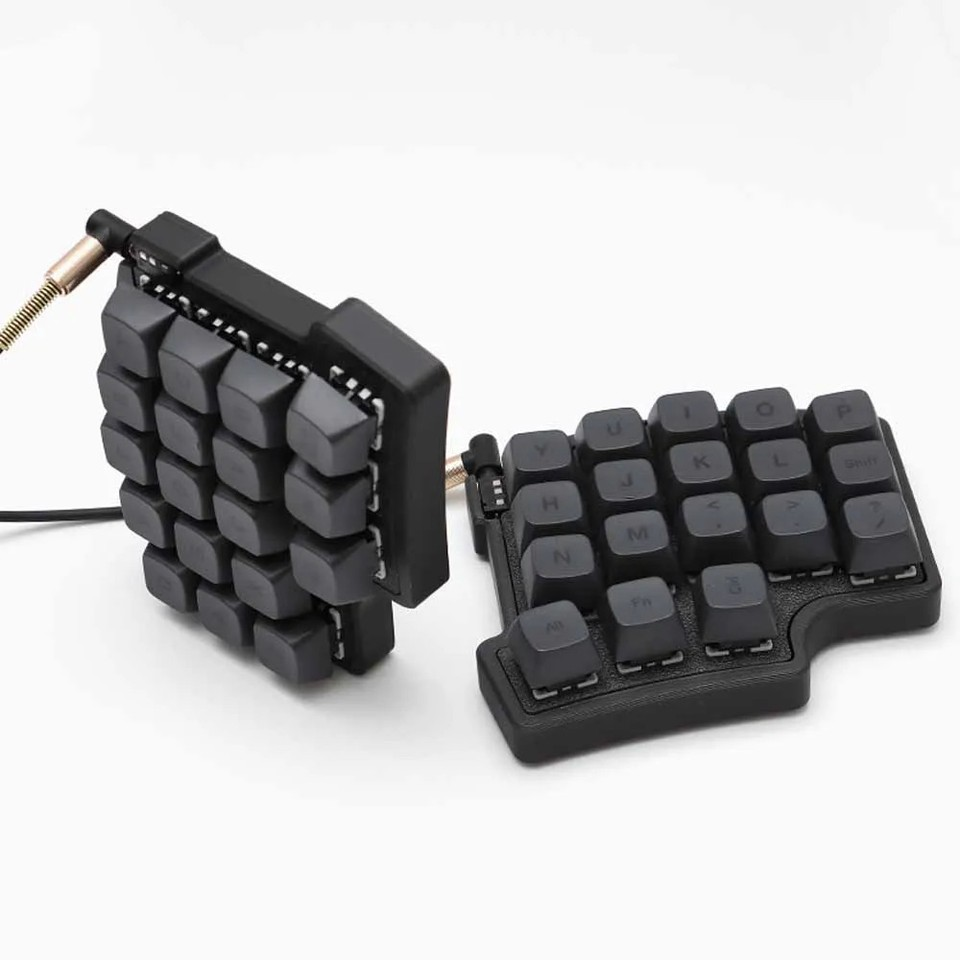
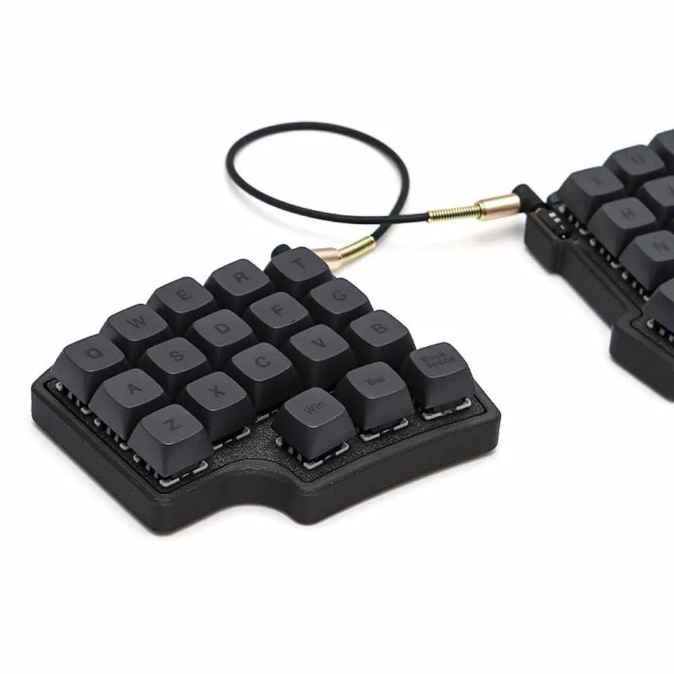

# Yxa

**Yxa** (Swedish for "Axe") — A 36-Key Split Ergonomic Keyboard with Miryoku Layout

## Overview

This repository contains:
- **QMK Firmware** with [Miryoku](https://github.com/manna-harbour/miryoku) layout
- **Visual Guide** for learning and training the Miryoku layout

## Layout


The Yxa uses the **Miryoku** layout system with **Colemak-DH** as the base layer:

| Layer | Index | Activation | Description |
|-------|-------|------------|-------------|
| BASE | 0 | Default | Colemak-DH with home row mods (GACS) |
| EXTRA | 1 | Double-tap | QWERTY alternative |
| TAP | 2 | Double-tap | No home row mods (gaming/fast typing) |
| BUTTON | 3 | Hold Z/Slash | Mouse buttons, clipboard |
| NAV | 4 | Hold Space | Arrow keys, navigation, Caps Word |
| MOUSE | 5 | Hold Tab | Mouse movement, scroll wheel |
| MEDIA | 6 | Hold Escape | Volume, playback, RGB controls |
| NUM | 7 | Hold Backspace | Number pad layout |
| SYM | 8 | Hold Enter | Symbols (shifted numbers) |
| FUN | 9 | Hold Delete | Function keys F1-F12 |

<center></img> </img> </img> </img> </img> </img> </img> </img></center>


### Key Features

- **Home Row Mods (GACS)**: GUI, Alt, Ctrl, Shift on home row when held
- **Layer-Tap Thumbs**: All 6 thumb keys access layers when held
- **Caps Word**: Toggle with CW key in NAV layer (Shift+CW = Caps Lock)
- **Tap Dance**: Double-tap top row in secondary layers to switch default layer
- **Double-tap Boot**: Enter bootloader by double-tapping BOOT key

## Hardware

| Feature | Specification |
|---------|---------------|
| Layout | 36-Key Split Ergonomic (3x5+3) |
| MCU | STM32F401CCU6 (BlackPill) |
| Connection | Wired USB-C |
| Inter-half | TRS Cable |
| Switches | Hot-Swappable MX Compatible |
| Backlighting | Per-Key RGB (WS2812) |

Based on the **SZR35** / "Hardtochooseone" keyboard from AliExpress/Ebay.

<center></img> </img> </img> </img> </img> </img> </img> </img></center>


## Quick Start

```bash
cd yxa
nix develop

# Build firmware
build-firmware-docker    # Uses Docker (recommended)
build-firmware           # Uses local QMK installation

# Flash firmware (enter DFU mode first)
flash-yxa

# Run visual guide
guide
```

## Firmware

```
firmware/
├── keyboards/yxa/           # Keyboard definition
│   ├── keyboard.json        # Matrix, pins, USB config
│   ├── config.h             # Hardware config
│   └── keymaps/miryoku/     # Keymap
│       ├── keymap.c         # Layer definitions
│       ├── rules.mk         # Feature flags
│       └── yxa_features.c   # RGB & HID features
└── users/manna-harbour_miryoku/  # Miryoku userspace
```

### Enabled Features

| Feature | Description |
|---------|-------------|
| MOUSEKEY | Mouse keys on MOUSE layer |
| EXTRAKEY | Media/system keys |
| CAPS_WORD | Smart caps for typing words in ALL CAPS |
| TAP_DANCE | Double-tap layer switching |
| KEY_OVERRIDE | Shift+Caps Word = Caps Lock |
| RAW_HID | Layer/keypress broadcast to visual guide |
| RGB_MATRIX | Per-key RGB with layer indication |

### RGB Layer Indication

- **BASE/EXTRA/TAP**: Finger-colored keys (pinky=cyan, ring=magenta, middle=green, index=yellow, thumb=blue)
- **Other layers**: Solid color matching layer (NAV=cyan, MOUSE=green, MEDIA=purple, NUM=yellow, SYM=red, FUN=blue)

### Building

Using Docker (recommended):
```bash
build-firmware-docker
```

Using local QMK:
```bash
build-firmware
```

### Flashing

1. Enter DFU mode: Hold BOOT button while plugging in USB (or double-tap BOOT key in NAV/MOUSE/MEDIA layers)
2. Run: `flash-yxa`

Each half must be flashed separately.

## Visual Guide

An interactive overlay for learning the Miryoku layout:

```bash
# Run with HID keyboard feedback
guide

# Run without HID (demo mode)
guide --no-hid
```

### Features

- **Real-time layer display**: Shows current layer from keyboard via HID
- **Keypress highlighting**: Keys light up as you press them
- **Finger color coding**: Same color scheme as keyboard RGB
- **Layer colors**: Match keyboard RGB for consistency
- **Transparent overlay**: Stays on top of other windows
- **Settings menu**: Right-click to adjust transparency, show/hide elements

### Controls

- **Right-click**: Open settings menu
- **Drag**: Move window
- **Escape**: Close

## Project Structure

```sh
yxa/
├── firmware/              # QMK firmware source
│   ├── keyboards/yxa/     # Keyboard definition
│   └── users/             # Miryoku userspace
├── visual-guide/          # Rust visual guide
│   ├── src/               # Source code
│   └── layouts/           # Layout files (.vil)
└── flake.nix              # Nix development environment
```

## Attribution

- **Miryoku Layout**: [manna-harbour/miryoku](https://github.com/manna-harbour/miryoku) by Manna Harbour
- **Hardware**: SZR35 / "Hardtochooseone" split keyboard

## License

- Firmware: GPL-2.0-or-later (following QMK/Miryoku licensing)
- Visual Guide: MIT
